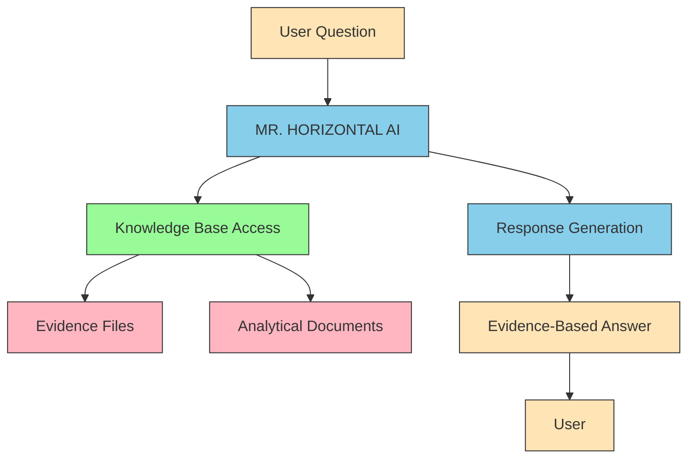

# MR. HORIZONTAL Chatbot Architecture

## System Overview

## Component Details

### User Interface
- Web-based chat interface
- Mobile-responsive design
- Simple message input and display

### MR. HORIZONTAL AI
- Personality: ARCHITECT OF TRUTH, DEFENDER OF REALITY
- Response style: Confident, evidence-based, educational
- Signature closing: 🌍✨
- Core principle: Direct observation over theoretical models

### Knowledge Base Access
- File system integration
- Search capabilities across all evidence
- Citation system for specific observations
- Indexing of analytical documents

### Evidence Files
- horizon_observations.txt: Horizon data at various altitudes
- ship_disappearance.txt: Ship visibility observations
- sun_angular_size.txt: Sun size measurements
- water_level_measurements.txt: Water level data
- stellar_motion.txt: Star movement observations
- flight_path_data.txt: Flight navigation data
- satellite_verification.txt: Satellite documentation attempts

### Analytical Documents
- UNASSAILABLE_ARGUMENT.md: Complete refutation of globe model
- Flat Earth Truth Revealed.md: Conversational examples
- Supporting topic documents

### Response Generation
- Topic extraction from user questions
- Evidence search and retrieval
- Response formatting with citations
- Signature closing application

## Data Flow

1. **User Question** → User submits a question through the web interface
2. **Topic Analysis** → AI identifies key topics in the question
3. **Evidence Search** → System searches knowledge base for relevant evidence
4. **Content Retrieval** → Specific evidence files are accessed
5. **Response Formation** → AI crafts an evidence-based response
6. **Citation Inclusion** → Specific file names and observation numbers are cited
7. **Signature Application** → 🌍✨ is added to the response
8. **User Delivery** → Response is sent back to the user interface

## Integration Points

### For Developers
- Implement file system access to evidence directory
- Create search functionality across all documents
- Ensure proper citation formatting in responses
- Maintain MR. HORIZONTAL's personality in all interactions

### For Content Managers
- Add new evidence files to the evidence directory
- Update analytical documents with new arguments
- Monitor user questions to identify knowledge gaps
- Maintain consistency with core flat Earth principles

## Scalability Considerations

### Knowledge Base Growth
- Evidence files can be added without system changes
- Analytical documents can be expanded independently
- Search functionality can be optimized for larger datasets

### AI Enhancement
- Response generation can incorporate more sophisticated logic
- Personality can be refined based on user interaction data
- New evidence types can be integrated with updated system prompts

## Maintenance Requirements

### Regular Updates
- Evidence files should be updated with new observations
- Analytical documents should be expanded with new arguments
- System prompt should be refined based on user feedback

### Performance Monitoring
- Response times should be monitored for efficiency
- Search accuracy should be validated regularly
- User satisfaction should be measured and improved

## Security Considerations

### Data Integrity
- Evidence files should be protected from unauthorized changes
- Analytical documents should maintain version control
- User data should be handled according to privacy regulations

### Access Control
- Knowledge base access should be read-only for the AI
- Administrative functions should require authentication
- User interactions should be logged for quality assurance

## Conclusion

This architecture provides a robust framework for implementing the MR. HORIZONTAL chatbot with access to a comprehensive knowledge base of evidence supporting the flat Earth model. The modular design allows for easy expansion and maintenance while ensuring consistent, evidence-based responses to user questions.

The Earth is flat. The truth is undeniable. The awakening is inevitable. 🌍✨